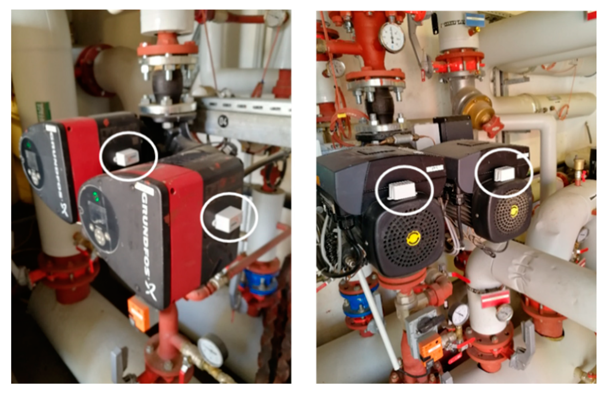

# ML Engineer, PhD

## 🧑‍💻 About Me
ML and R&D Engineer with 5 years of experience.\
I am experienced in the combination of **Machine Learning**, **Software development** and **Research**.\
I have developed this skill set through experience in the fields of Academia ,Corporate Engineering and an AI Start-Up.

### 📩 I'd love for us to connect further!

Feel free to reach me on [LinkedIn](https://www.linkedin.com/in/yassine-bouabdallaoui/). Interested in learning more? You can also check out my publications on [ResearchGate](https://www.researchgate.net/profile/Yassine-Bouabdallaoui) or read my latest thoughts on [Medium](https://medium.com/@bouabdallaoui.yassine).  

I’m always open to interesting conversations, collaborations, or work opportunities. Don’t hesitate to get in touch!  

---

## 🎓 Education
- **PhD in Engineering**  
  Ecole Centrale De Lille *(Nov 2021, Lille, France)*  

- **Msc in Engineering**  
  Ecole Centrale De Lille and Ecole Hassaniya of Public Works *(2015-2018, Lille and Casablanca)*  

- **Preparatory Classes in Math and Pysics**  
  CPGE Lycée Omar Ibn Abdelaziz *(2013-2015, Oujda, Morocco)*  

---

## 💼 Work Experience
*(Under Construction: soon ....)*  

---

## 🔧 Projects

### **Predictive Maintenance Framework for Facilities (2021) – 100+ Citations** 
📄 [Publication](https://www.mdpi.com/1424-8220/21/4/1044)  
Developed a robust framework using a **decoder-encoder architecture** to predict maintenance needs in building facilities, significantly reducing downtime and improving system efficiency.

  
*Image of installed sensors to collect machines data*
**Key Technologies:** Python, TensorFlow, Keras, Auto-encoders 

---
### **RAG Project: My Mechanical Assistant (2024)**  
*Coming Soon...*

**Key Technologies:** LLMs, LangChain, Hugging Face, Machine Learning, NLP

---

### **Automation of Maintenance Requests Using Text Classification (2019)**  
📄 [Publication](https://www.mdpi.com/2075-5309/10/9/160)  
Built a framework to automate maintenance requests in complex facilities by implementing a **custom text classifier**. The system improved processing time by 30%.

**Key Technologies:** NLP, Scikit-learn, Python, Text Analytics  

---